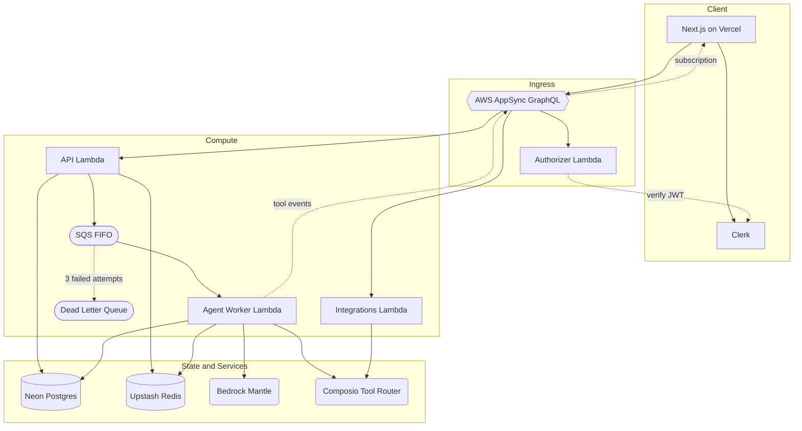
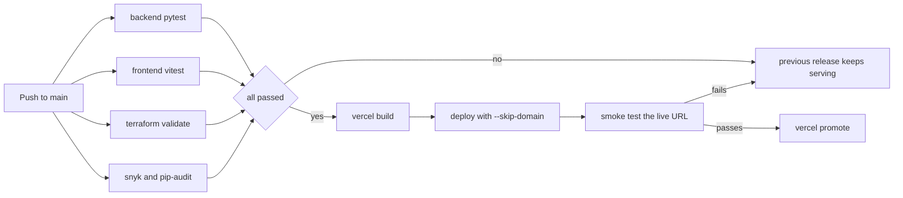

# Relaywise

Relaywise is an AI agent that carries out tasks across connected apps. Asked to find the latest message in Slack, it works out which tools it needs, locates the right channel and reads the message back. Asked for a page in Notion, it creates one. Tool definitions come from Composio's Tool Router, which covers 860+ apps including Slack, Gmail, Notion, Linear, GitHub and Discord.

Tools are discovered at runtime. The agent searches Composio's Tool Router for tools matching the request, reads their schemas to learn what arguments they take, and calls them against each app's REST API using OAuth credentials granted at connection time. A deterministic router runs first and resolves the target application from the message, the conversation, or a stored usage habit, so a request naming an app that is not connected is answered without a model call at all. Adding an app requires an OAuth connection.

The agent is a LangGraph tool loop running on a container-image Lambda, queued through SQS and reached from a Next.js frontend through AWS AppSync. Every tool call streams to the browser over a GraphQL subscription as it happens, conversations persist through LangGraph Postgres checkpoints, and a separate store retains durable facts about each user that carry into later sessions.

The backend is fully serverless and costs nothing between requests. Each user is capped at a monthly credit allowance worth $0.10 of model spend, metered from real token counts, priced from the AWS bill. All AWS infrastructure is defined in Terraform, and a GitHub Actions pipeline runs pytest across both Python services, Vitest and type checking for the frontend, Terraform validation, and security scanning with Snyk (SAST, IaC, npm) and pip-audit (Python). The frontend deploys to Vercel only after all of it passes.

## 1. Architecture



### Request lifecycle

A request splits in two. Synchronously, AppSync authorizes the caller, the API Lambda checks credits, titles the conversation, writes it to Postgres and queues a task, returning in under a second. Asynchronously, the worker resolves the target application, runs the tool loop, and broadcasts each tool call to the browser over a subscription.

The split exists because AppSync resolvers time out at 30 seconds. A healthy run takes 4 to 12 seconds, but one needing several rounds of tool discovery can pass 30.

## 2. Core Infrastructure & Engineering Impact

### Agent and models

* **Bedrock Mantle**: Serves the model, `minimax.minimax-m2.5`. Its OpenAI-compatible endpoint means the agent reaches it through LangChain's standard `ChatOpenAI` client with no vendor-specific code. Swapping models is a config change. Chosen by running four candidates against the live agent, where a synthetic benchmark separated none of them.

* **Composio Tool Router**: Provides the tools, across 860+ applications. `LangchainProvider` converts three meta-tools into LangChain tools the model can call: `COMPOSIO_SEARCH_TOOLS` to find capabilities for a request, `COMPOSIO_GET_TOOL_SCHEMAS` to read their arguments, and `COMPOSIO_MULTI_EXECUTE_TOOL` to run them. Discovering tools at runtime avoids carrying hundreds of schemas in every prompt.

* **LangGraph and LangChain**: The agent itself. `create_agent` compiles a ReAct-style state machine. Each cycle: the model receives the conversation plus tool schemas, emits a tool call, LangGraph runs it and appends the result to graph state, and the model runs again on the extended history. The loop ends when the model replies without calling a tool. `SummarizationMiddleware` condenses earlier messages past 24,000 tokens so a long thread stays in the context window. `AsyncPostgresSaver` checkpoints state per conversation so the next turn resumes with full history, `AsyncPostgresStore` holds cross-session facts recalled into the system prompt, and an `AsyncCallbackHandler` streams each tool call to the browser. Token counts are summed across every model call in a run, since reading only the last undercounts a tool loop roughly threefold.


### Backend and infrastructure

* **AWS AppSync**: The single entry point the browser talks to. Its schema fields are wired to Lambda data sources. A query or mutation invokes the API or integrations function directly, with no HTTP layer in between. Authentication is `AWS_LAMBDA`. The authorizer function runs before any resolver and passes the verified user id down in `resolverContext`.

  Subscriptions are why it is here rather than API Gateway. Streaming live agent progress needs a server-to-client push, and AppSync provides managed WebSocket subscriptions with no connection state to run. The mutations that drive them use a local data source. A tool event broadcast by the worker fans out to every subscribed browser without invoking a Lambda.

* **AWS Lambda**: All compute runs here as four container images. The **authorizer** verifies Clerk JWTs for every AppSync request. The **api** serves GraphQL resolvers, queues agent tasks and handles webhooks. The **integrations** function manages Composio connections. The **agent worker** consumes SQS and runs the LangGraph agent at 1024 MB against a measured peak of 305 MB. Splitting by trust boundary keeps the authorizer free of the agent's dependencies, and images are digest-pinned in Terraform so a rollback names an immutable artifact.

* **FastAPI with Mangum**: The Python web framework behind the API Lambda. Mangum adapts it to run on Lambda, serving the Composio webhook endpoint and health checks over API Gateway, while AppSync resolver payloads are dispatched to plain Python functions in the same image.

* **Amazon SQS FIFO with a dead letter queue**: The event source that runs the agent. The API Lambda writes a task to the queue and returns immediately; a Lambda event source mapping polls that queue and invokes the agent worker with the message. Nothing else triggers the worker. The queue is both trigger and buffer, absorbing load that would otherwise arrive as concurrent HTTP requests.

  This decoupling is what allows the two halves to run on different clocks. The API answers in under a second, well inside AppSync's 30 second resolver timeout, while the worker takes as long as the task needs. Worker concurrency is capped in Terraform to stop one user occupying every available worker.

  FIFO gives ordering per conversation: the message group is the conversation id, so turns in one chat are processed in sequence and "yes, send it" cannot overtake the message it answers, while separate conversations run in parallel. Deduplication is by task id rather than message content, since asking the same thing twice in a chat is legitimate and content-based dedup would silently drop the second.

  A failed task is retried twice more by the event source mapping, then moved to the **dead letter queue** instead of retrying forever. Anything that lands there has exhausted its retries. A CloudWatch alarm fires on the first message and sends an email.

* **Neon Postgres**: Conversations and messages, LangGraph checkpoints so the next turn resumes with what was said, and LangGraph's store for durable facts about a user. Scale-to-zero, with no cost while idle.

* **Upstash Redis**: Fast state on the request path. Holds the monthly credit balance, checked before a task is queued and decremented after it runs. Holds which applications a user has connected, which tells the agent what it can reach. Holds two signals used to resolve "check my messages" without asking which app: the last application used in this conversation, and a sorted set of usage counts as the fallback. Also maps a Composio account back to a user so incoming webhooks can be attributed.

* **AWS Secrets Manager**: Holds every runtime credential as one JSON secret: database URL, Redis token, Clerk, Composio and Bedrock. Each Lambda fetches it once at cold start using its IAM role.

* **Terraform**: Defines and provisions all AWS infrastructure as code: the four Lambda functions and their IAM roles, the AppSync API and its GraphQL schema and resolvers, the SQS queues, the ECR repository and lifecycle policies, Secrets Manager, the HTTP API for webhooks, CloudWatch log groups and alarms, SNS, EventBridge and the Bedrock budget. Split into two stacks, `terraform/orchestration` for the AppSync API and `terraform/api` for compute and supporting resources. A schema change and a code change deploy independently.


### Frontend

* **Next.js 16 with the App Router**: The entire frontend, deployed to Vercel. Server components read the Clerk session and fetch authenticated data before render, client components run the chat, integrations browser and settings, and `src/proxy.ts` enforces route access before any page is served.

* **Clerk**: Issues the session JWT, checked twice. The AppSync authorizer verifies it before any resolver runs, blocking a direct API call with a forged token. Clerk's proxy verifies it before a page renders, keeping a signed-out visitor off the dashboard.

* **Apollo Client with `aws-appsync-subscription-link`**: The GraphQL client. Queries and mutations go over HTTP, subscriptions over a WebSocket, with the AppSync handshake and Clerk token handled by the link.

* **Zustand, Tailwind and shadcn/ui**: Client state, styling and component primitives. Zustand holds the conversation list, connected application ids and loading flags.


### Observability

* **AWS Lambda Powertools**: Instrumentation for both Python services. `task_id`, `session_id` and `user_id` are appended to the logger once when a task starts and then ride every subsequent record, including ones written deep inside the agent. One CloudWatch Logs Insights query on `task_id` returns the whole request: which application the router chose, every tool called, tokens consumed, credits charged, and how it ended. Metrics use Embedded Metric Format, printed to stdout and parsed by CloudWatch rather than sent over the network. Recording one never blocks a handler.

* **Amazon CloudWatch**: Ten custom metrics in a `Relaywise` namespace covering the funnel from `AuthAccepted` and `AuthDenied` through `TaskAccepted`, `TaskStarted`, `TaskCompleted` and `TaskFailed`, plus `ModelSpendUsd`, `InputTokens` and `OutputTokens`. `AuthAccepted` and `AuthDenied` sum to the authorizer's Lambda invocation count, which confirms the metrics are complete. Two alarms notify through SNS: any message in the dead letter queue, and worker errors across two consecutive five-minute windows. Both read metrics AWS emits. A process that dies during import cannot report its own failure. Log groups are JSON-formatted with 7 day retention.

* **AWS SNS and Budgets**: Alarm delivery by email, and a monthly Bedrock budget warning at 50%, 80% and 100% of a dollar ceiling with a forecast alert, excluding AWS billing credits so it tracks what usage is genuinely worth.


### CI/CD, testing and security

* **GitHub Actions**: The CI/CD pipeline. Six jobs on every push and pull request: pytest for the agent worker, pytest for the API, Vitest with typecheck and lint for the frontend, Terraform validation, four security scans, and a gated Vercel release that only runs if the other five pass.

* **Snyk**: Security scanning, run in GitHub Actions on every push and pull request across three surfaces. `snyk code test` performs SAST on the Python and TypeScript source, looking for injection, unsafe deserialization and hardcoded secrets. `snyk iac test` scans the Terraform for infrastructure misconfiguration such as over-permissive IAM, unencrypted resources and public access. `snyk test` performs SCA against the 296 npm dependencies for known advisories. A finding at high severity or above fails the job and blocks the release.

* **pip-audit**: SCA for Python, run in the same GitHub Actions job, checking all 74 packages against the Python advisory database.

* **pytest**: The Python test suites, run in GitHub Actions on every push and pull request. 74 tests for the agent worker and 33 for the API, covering credit metering, the application router, prompts, GraphQL dispatch and the invariants that guard past outages.

* **Vitest**: The frontend test suite, run in the same pipeline. 16 tests covering route protection, including assertions that routes which do not exist yet are still protected.

* **Vercel**: Hosts the Next.js frontend. Git auto-deploy is off; releases come from the pipeline.

* **uv and Python 3.13**: Dependency management, installed frozen in CI so the tested tree is the committed one.

## 3. Repository Layout

```
api/                    AppSync resolvers and webhook surface (FastAPI, Mangum)
  app/core/             settings, logging, metrics
  app/db/               SQLAlchemy models, session, repositories
  app/clients/          Redis and SQS clients
  app/services/         credits, task queue, integrations
  app/graphql/          resolver registry, context, resolvers
  app/routes/           health and webhooks
  authorizer.py         Clerk JWT verification, standalone by design

backend/                the agent worker
  src/agent/            LangGraph agent, prompts, app router, streaming
  src/credits/          pricing, period, calculator, checker
  src/memory/           chat memory and cross-session user memory
  src/integrations/     Composio connection management
  src/observability/    logger and metrics
  src/worker/           SQS handler and completion publisher
  evals/                LangSmith eval harness

frontend/               Next.js application
terraform/              api and orchestration stacks
scripts/                build, deploy and catalog tooling
```

The API is organized by responsibility. `app/graphql/router.py` holds a resolver registry. A schema field with no registered resolver returns an explicit error.

## 4. Installation & Setup

### Prerequisites

An AWS account, a Neon Postgres database, an Upstash Redis database, a Clerk application, a Composio API key, and Bedrock Mantle access. Docker is required to build the Lambda images.

### 1. Store runtime secrets

Every credential lives in one Secrets Manager secret:

```bash
aws secretsmanager create-secret \
  --name relaywise/lambda/secrets \
  --secret-string '{
    "DATABASE_URL": "postgresql://...",
    "UPSTASH_REDIS_REST_URL": "https://...",
    "UPSTASH_REDIS_REST_TOKEN": "...",
    "CLERK_SECRET_KEY": "sk_...",
    "CLERK_DOMAIN": "your-app.clerk.accounts.dev",
    "COMPOSIO_API_KEY": "...",
    "BEDROCK_MANTLE_API_KEY": "...",
    "BEDROCK_MANTLE_BASE_URL": "https://...",
    "BEDROCK_MODEL_ID": "minimax.minimax-m2.5",
    "CALLBACK_URL": "http://localhost:3000/integrations"
  }'
```

### 2. Deploy the backend

The first apply creates shared infrastructure only, letting images be pushed before any function exists. The alert address is set in `terraform.tfvars`, a git-ignored file.

```bash
cd terraform/api
terraform init
cp terraform.tfvars.example terraform.tfvars   # set alert_email
terraform apply -var deployment_phase=bootstrap
```

Then build, push and deploy in one step. Name individual images to rebuild only what changed. `apply-infra.sh` applies configuration changes on their own, defaulting to whatever images are already live.

```bash
./scripts/build-and-push.sh --deploy          # all three images
./scripts/build-and-push.sh worker --deploy   # only the agent worker
./scripts/apply-infra.sh --apply              # config only, no rebuild

cd terraform/orchestration && terraform init && terraform apply
```

Confirm the SNS subscription email afterwards, or the alarms notify nobody.

### 3. Run the frontend

```bash
cd frontend
cp .env.local.example .env.local   # Clerk keys and the AppSync endpoint
npm install
npm run dev
```

Runs at `http://localhost:3000`.

## 5. CI/CD & Security

Every push and pull request runs six jobs in GitHub Actions. The first five run in parallel; the sixth only runs if all of them pass.

| Job | Tool | What it runs |
|---|---|---|
| `backend` | pytest | 74 tests for the agent worker |
| `api` | pytest | 33 tests for the GraphQL and webhook service |
| `frontend` | Vitest, tsc, ESLint, Prettier | 16 tests, type check, lint, format check |
| `terraform` | Terraform | `fmt -check` and `validate` on both stacks |
| `security` | Snyk, pip-audit | SAST, IaC, and dependency scanning (below) |
| `deploy` | Vercel CLI | Build, staged deploy, smoke test, promote |



### Security scanning

Four scans, all inside the `security` job, all at a high severity threshold so an unfixable transitive medium reports without blocking a release.

| Type | Tool | Target |
|---|---|---|
| SAST | `snyk code test` | Python and TypeScript source |
| IaC | `snyk iac test` | Terraform, for over-permissive IAM, unencrypted resources, public access |
| SCA | `snyk test` | 296 npm packages |
| SCA | `pip-audit` | 74 Python packages |

Python uses pip-audit. Snyk's pip resolver covered 31 of the 74 packages, skipping langchain, langgraph, openai, composio and boto3, and reported a `cryptography` version that appeared in neither the lockfile nor the installed environment.

### Deployment

The frontend releases to Vercel from this pipeline. AWS is deployed separately from a workstation with `./scripts/build-and-push.sh --deploy`, which builds the images, pushes to ECR and applies Terraform against the resulting digests. Keeping AWS out of CI means no long-lived AWS credentials in GitHub, and the `terraform` job runs with `-backend=false` so it needs none.

Vercel's own Git integration is switched off. Left on, it would deploy on push in parallel with this pipeline, bypassing the checks.

The release is staged before it is promoted. `vercel deploy --skip-domain` publishes the build to its own URL while the production domain still points at the previous release. A smoke test then checks that the landing page returns 200 and that `/dashboard` does **not**, since a change to `proxy.ts` exposing an authenticated route would pass every other check in this pipeline. Only then does `vercel promote` move the domain. If the smoke test fails, the previous release keeps serving.

The workflow itself is hardened: `permissions: contents: read` by default, `persist-credentials: false` on checkout so the token is not left in `.git/config`, `concurrency` with `cancel-in-progress` so two runs cannot race to promote different commits, and the deploy job skipped on pull requests so a fork can neither reach production nor read the deploy token.

## 6. Testing & Evaluations

### Tests

```bash
cd backend && uv run pytest      # 74 tests
cd api     && uv run pytest      # 33 tests
cd frontend && npm test          # 16 tests
```

Several tests pin invariants that are cheap to break: the authorizer importing nothing shared, the worker importing no agent code at module scope, route protection covering paths that do not exist yet, and the credit TTL never falling below the longest month.

### Evaluations

The eval harness lives in `backend/evals` and traces to LangSmith when `LANGSMITH_TRACING` is set. It works without LangSmith, printing to the terminal instead.

```bash
uv run python -m evals.run             # everything
uv run python -m evals.run intent      # deterministic only, no API calls
uv run python -m evals.compare_models  # candidate model comparison
```

The split matters. Intent routing is a pure function, exactly checkable and free, and runs in CI. Memory extraction calls the model, costs money and is not perfectly repeatable, and is run when a prompt changes.

## 7. Cost Control

Each user gets 100 credits per calendar month, worth $0.10 of model spend. Credits are metered from real token counts at $0.30 per million input tokens and $1.20 per million output, both taken from the AWS bill. Change the model, change those two numbers, and the allowance keeps its cash value with nothing else to adjust.

The balance is held in Redis under a key containing the calendar month. A new month reads a new key and the allowance resets without a scheduler. A 31 day TTL, matching the longest month, removes expired keys. When it reaches zero the API refuses the request before anything is queued, and the user is told the date their credits return. An exhausted user never costs a Lambda invocation or a cold start.

A monthly AWS Budget on Bedrock sits underneath as a second line, notifying at 50%, 80% and 100% of the ceiling, with AWS billing credits excluded so it tracks what the usage is genuinely worth. `ModelSpendUsd` in CloudWatch shows spend within a minute, where Cost Explorer lags about a day.

Idle cost is close to zero. Lambda, SQS and AppSync bill per request, Neon and Upstash scale to zero, and nothing runs on a schedule except a keepalive every three days that stops the free-tier stores being reclaimed while the project sits idle.

There is no billing, subscription tier or paid plan. The credit system is only there to cap spend.

## 8. Key Technical Achievements

* **Runtime Tool Discovery**: Measured per-application tool loading at 9,292 tokens per model call against 3,603 for Composio's meta-tools, and built the agent on the latter. Discovery consumes model calls of its own, which is why spend is bounded by the credit system and not by a limit on calls.

* **Zero-Token App Resolution**: Engineered a deterministic resolver that runs before the model is ever called, resolving the target application from the app named in the message, the last one used in that conversation, or a usage count held in a Redis sorted set. Unconnected and ambiguous requests are answered from this step, at no token cost.

* **Model Selection on Real Runs**: Benchmarked four candidate models against the live agent on a real Slack workspace instead of a synthetic suite, which every model passed and which separated none of them.

  | model | tokens | time | outcome |
  |---|---|---|---|
  | minimax-m2.5 | 18,624 | 37s | correct, named the exact message |
  | deepseek-v3.2 | 45,900 | 58s | correct, 2.4x the cost |
  | kimi-k2.5 | 10,956 | 34s | gave up and asked which channel |
  | qwen3-32b | 31,580 | 45s | wrong channel, asked permission |

  Kimi was cheapest because it stopped early and asked a question, which costs its tokens and still needs a follow-up, which makes token count a misleading way to compare them.

* **Token Cost Analysis**: Instrumented a real agent run to find input outweighing output 48 to 1, at 27,311 tokens against 564. Tool results replay verbatim on every model call, which makes loop length the main driver of spend. Every cost decision in the system follows from this ratio.

* **Dollar-Anchored Credit Metering**: Built a metering system where the allowance is expressed in dollars and every other figure is derived from it. A model change is two per-million rates and nothing else. Rates come from Cost Explorer filtered to usage records. AWS billing credits otherwise zero out every line.

* **Lazy Imports for Cold Starts**: Lambda caps initialization at ten seconds whatever the function timeout is, and the LangChain, LangGraph and Composio import chain exceeds it. Deferring those imports into the handler moves the work to the invoke phase where no ceiling applies, avoiding an initialization that is discarded and repeated. An AST-parsing test fails the build if any of them reappear at module scope.

* **Alarms That Survive a Crash**: Alarms watch metrics AWS emits. A process that dies during initialization cannot report its own death. Instrumented failure counts and platform failure counts were observed to disagree three against nine under exactly that condition. The worker error alarm triggers on two consecutive five-minute windows with any error, which catches a sustained fault while ignoring one transient error.

* **Audited Scanner Coverage**: Audited what the dependency scanner actually inspected instead of trusting a green result. Snyk's Python scanner reported a clean pass while resolving 31 of 74 packages, silently skipping langchain, langgraph, openai, composio and boto3, and reported a `cryptography` version present in neither the lockfile, the export, nor the installed environment. Python scanning runs on pip-audit for full coverage, with Snyk retained for SAST, IaC and npm.

* **Route Protection by Allowlist**: Route access is enforced in `src/proxy.ts` against an allowlist of public paths. Every route is protected unless explicitly published. A route that has not been written yet is already covered, and tests assert that for paths which do not exist.

## License

MIT
